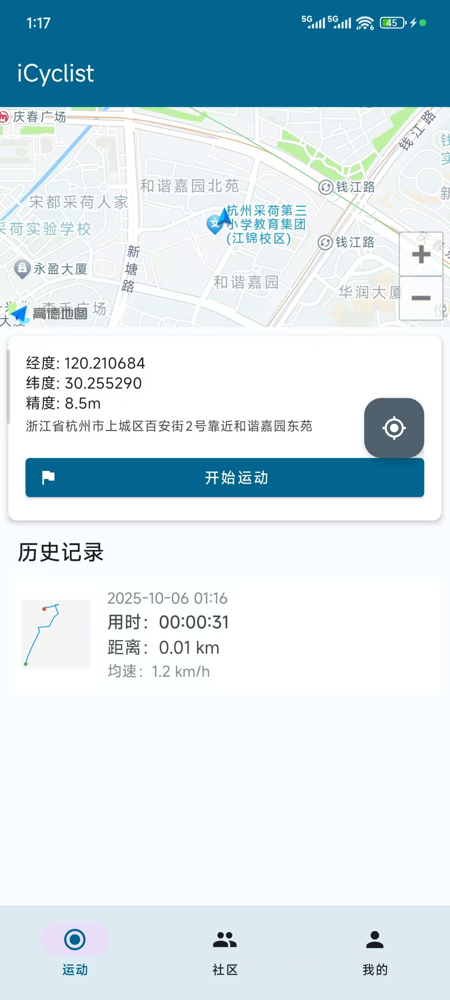

# iCyclist - 智能骑行助手

iCyclist 是一款专为骑行爱好者设计的 Android 应用，提供实时运动轨迹记录、社区分享、个人资料管理等功能。

---

## 🖼️ 应用界面预览

|              登录               |                注册                |             主界面             |
| :-----------------------------: | :--------------------------------: | :----------------------------: |
|  |  |  |

|            运动界面             |              运动结束               |             运动记录操作             |
| :-----------------------------: | :---------------------------------: | :----------------------------------: |
|  |  |  |

|                社区                 |               我的                |                编辑资料                |
| :---------------------------------: | :-------------------------------: | :------------------------------------: |
|  |  |  |

---

## 🚀 快速开始

1. 克隆项目
   ```bash
   git clone <your-repository-url>
   cd iCyclist
   ```
2. 配置 API 密钥
   - 复制 `apikeys.properties.example` 为 `apikeys.properties`
   - 填入您的高德地图 API KEY
3. 配置 SDK 路径 (如需)
   - 复制 `local.properties.example` 为 `local.properties`
   - 填入 Android SDK 路径
4. 构建与运行
   - Android Studio 打开项目
   - 点击 "Sync Project with Gradle Files"
   - 连接设备或模拟器
   - 点击 "Run 'app'"

---

## ✨ 主要功能一览

- **注册/登录/个人资料编辑**: 支持昵称、头像管理，资料安全加密存储
- **运动追踪与记录**: 实时地图定位，自动生成轨迹缩略图
- **社区分享**: 一键分享运动记录至社区，支持缩略图、昵称、头像展示
- **运动记录管理**: 历史记录列表，支持长按分享、删除等操作
- **丝滑 Fragment 切换**: 主界面、运动、社区、我的等 Tab 无缝切换
- **地图自动缩放**: 运动开始后自动调整至最佳比例
- **本地数据持久化**: Room 数据库保存所有运动与社区数据
- **安全退出机制**: 防止误操作，数据安全

---

## 📖 使用流程

1. **注册/登录**

   - 新用户填写邮箱、密码、昵称注册
   - 支持头像上传与资料编辑
   - 登录后自动跳转主界面

2. **主界面导航**

   - 底部导航栏: 运动、社区、我的
   - Tab 间切换无延迟动画

3. **开始运动**

   - 等待地图定位成功(蓝色圆点)
   - 点击“开始运动”进入运动追踪界面
   - 实时显示速度、距离、时长等数据

4. **结束运动与分享**

   - 长按“结束运动”保存记录
   - 运动记录自动生成轨迹缩略图
   - 长按历史记录可一键分享到社区

5. **社区互动**

   - 社区 Tab 展示所有用户分享内容
   - 卡片包含头像、昵称、时间、轨迹缩略图

6. **个人资料管理**
   - 我的 Tab 显示当前用户信息
   - 支持编辑昵称、头像
   - 资料加密存储，安全可靠

---

## 🏗️ 项目架构（详细说明）

项目采用“单 Activity + 多 Fragment”为主架构，界面划分为 Sport / Community / Profile 三大模块，底部导航负责切换。代码按职责划分包结构，便于维护与扩展：

- 顶层目录（app/src/main/java/com/example/icyclist）
  - `activity/` 或 `ui/activity/`（视工程组织）
    - `MainContainerActivity.kt` — 应用主容器，负责 Fragment 切换、底部导航与全局路由
    - `SportTrackingActivity.kt` — 全屏运动追踪（实时地图、传感器、记录生成）
  - `fragment/` 或 `ui/fragment/`
    - `SportFragment.kt` — 运动主页面（历史记录列表、开始/分享入口）
    - `CommunityFragment.kt` — 社区页面（帖子列表、加载与展示）
    - `ProfileFragment.kt` — 我的页面（资料展示、编辑入口）
  - `adapter/`
    - `SportRecordAdapter.kt` — 运动记录列表适配器（长按分享、删除操作）
    - `CommunityPostAdapter.kt` — 社区帖子卡片渲染（头像、昵称、缩略图）
  - `database/`
    - `SportDatabase.kt` — Room 数据库入口与迁移定义（MIGRATION_1_2）
    - `SportRecordEntity.kt`、`CommunityPostEntity.kt` — 实体定义
    - `SportRecordDao.kt`、`CommunityPostDao.kt` — DAO 操作接口
    - `converters/` — TypeConverter（List<LatLng> ↔ JSON）
  - `manager/` 或 `util/`
    - `UserManager.kt` — 用户状态、注册/登录、加密偏好存取（EncryptedSharedPreferences）
    - `TrackThumbnailGenerator.kt` — 生成轨迹缩略图（Canvas 绘制）
  - `ui/`（资源）
    - `layout/`、`anim/`、`drawable/` 等资源目录按功能组织

数据流（简要）

- 运动记录创建：
  SportTrackingActivity -> 生成 SportRecordEntity -> Room.insert -> 触发缩略图保存到 filesDir -> 返回 SportFragment 更新列表
- 分享到社区：
  SportFragment 长按记录 -> 构建 CommunityPostEntity（包含 trackThumb 路径、用户昵称/头像）-> Room.insert -> 切换 CommunityFragment 加载并显示

关键设计决策

- 单 Activity + Fragment：保持底部导航与状态一致，减少 Activity 切换开销
- Room 自动迁移：通过 MIGRATION 保证数据库升级过程无数据丢失
- 用户信息存储：使用 EncryptedSharedPreferences 存放敏感信息（邮箱、昵称、头像路径等）
- 图片与文件：头像、缩略图存放于 `filesDir`（子目录 avatars/ / thumbnails/）

---

## 🔧 技术架构与实现

- **架构模式**: 单 Activity+多 Fragment，主界面、运动、社区、我的 Tab 统一管理
- **数据持久化**: Room 数据库，自动迁移，运动/社区/用户数据本地保存
- **安全加密**: EncryptedSharedPreferences 存储用户资料
- **地图与定位**: 高德地图 SDK，实时轨迹绘制，自动缩放
- **图片处理**: 运动轨迹自动生成缩略图，社区分享自动适配图片大小
- **异步处理**: Kotlin Coroutines，UI 流畅不卡顿
- **动画与 UI**: Material Design 3，Fragment 切换淡入淡出动画
- **可扩展性**: 代码结构清晰，便于功能扩展(如点赞、评论、粉丝系统)

---

## 🔐 安全与协作

- **API 密钥管理**: `apikeys.properties`已加入`.gitignore`，不会泄露
- **资料加密**: 用户信息本地加密存储，隐私安全
- **团队协作**: `.gitignore`配置完善，支持多人开发
- **新成员指引**: 复制`.example`配置文件即可快速上手

---

_祝您骑行愉快！_ 🚴‍♂️
