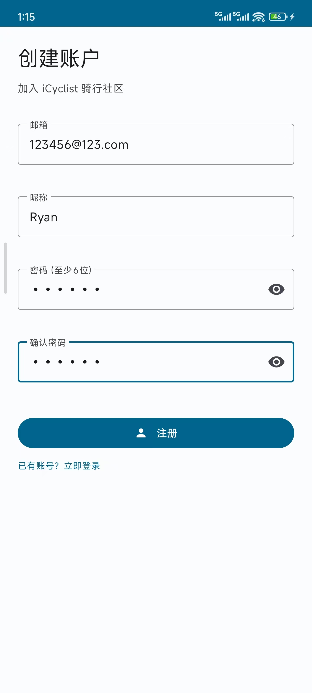
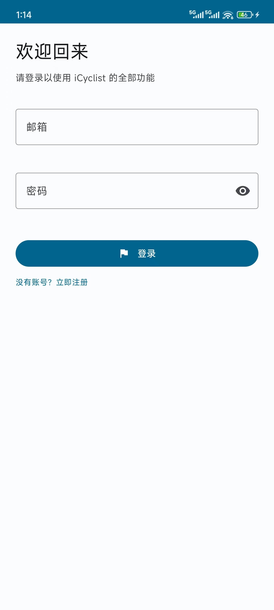
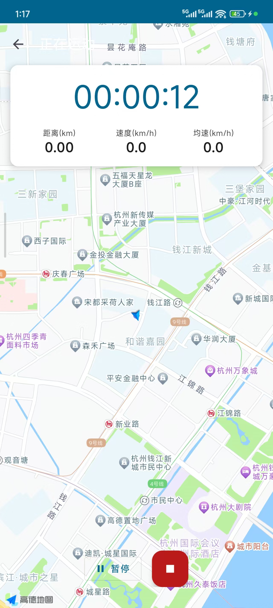
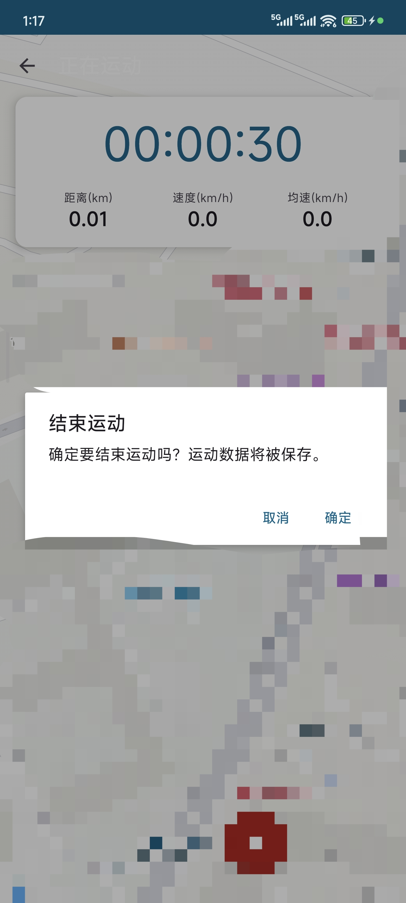
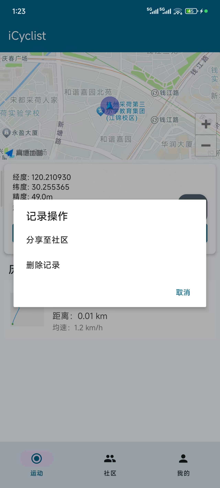
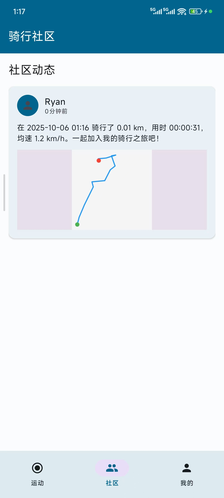
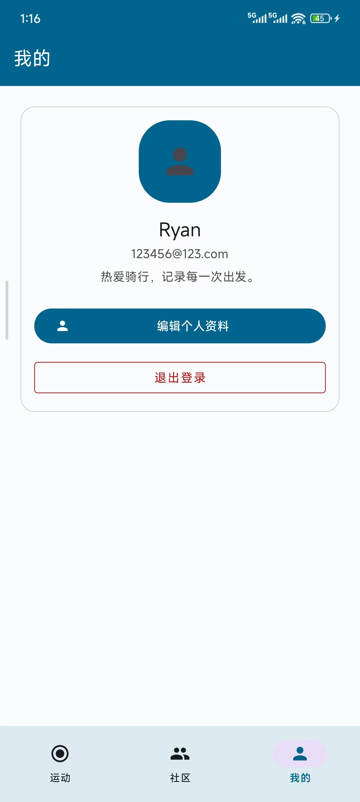
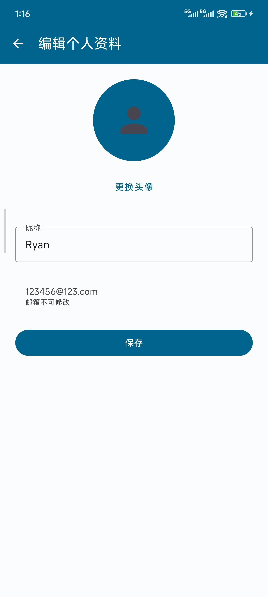

# iCyclist 用户使用手册

<div align="center">
  <h2>🚴 欢迎使用 iCyclist 智能骑行助手</h2>
  <p>您的专属骑行记录与社交平台</p>
</div>

---

## 📑 目录

1. [快速开始](#快速开始)
2. [功能详解](#功能详解)
3. [常见问题](#常见问题)
4. [使用技巧](#使用技巧)
5. [注意事项](#注意事项)

---

## 快速开始

### 第一步：安装应用

1. **下载APK文件**
   - 从项目发布页面下载最新版本APK
   - 或通过构建工具生成：`./gradlew assembleDebug`

2. **安装应用**
   - 在Android设备上打开APK文件
   - 允许"安装未知来源应用"权限
   - 点击"安装"

3. **授予必要权限**
   首次启动时，应用会请求以下权限：
   - ✅ **位置权限**（精确位置）- 用于GPS追踪
   - ✅ **存储权限**（照片/媒体）- 用于保存图片
   - ✅ **网络权限** - 用于加载地图

### 第二步：注册账号

<div align="center">
  
</div>

1. 启动应用后，点击"没有账号？立即注册"
2. 填写注册信息：
   - **邮箱**：用于登录的唯一标识（如：`cyclist@example.com`）
   - **昵称**：在社区中显示的名称（2-20个字符）
   - **密码**：至少6位字符
   - **确认密码**：再次输入密码
3. 点击"注册"按钮
4. 注册成功后自动跳转到登录页面

### 第三步：登录应用

<div align="center">
  
</div>

1. 输入注册时使用的**邮箱**和**密码**
2. 点击"登录"
3. 登录成功后进入主界面

---

## 功能详解

### 1. 运动模块 🚴

<div align="center">
  
  
</div>

#### 开始骑行

1. **准备工作**
   - 确保手机GPS已开启
   - 确保应用已获得位置权限
   - 建议在室外空旷环境使用

2. **启动追踪**
   ```
   点击底部导航栏"运动"Tab
   ↓
   等待GPS定位（显示蓝色定位点）
   ↓
   点击"开始骑行"按钮
   ↓
   开始记录轨迹
   ```

3. **运动中**
   - 实时查看：
     - ⏱ **运动时长**（格式：00:00:00）
     - 📏 **运动距离**（单位：km）
     - 🚀 **当前速度**（单位：km/h）
     - 📊 **平均速度**（单位：km/h）
     - 🔥 **消耗卡路里**（实时计算）
   
   - 地图操作：
     - 🗺 **切换地图模式**：标准/卫星/夜间
     - 🔍 **缩放地图**：双指捏合
     - 🧭 **旋转地图**：双指旋转
     - 📍 **回到当前位置**：点击定位按钮

4. **暂停/继续**
   - 点击"暂停"按钮可暂时停止记录
   - 点击"继续"按钮恢复记录
   - 暂停期间不计入运动时长和距离

5. **结束运动**
   ```
   点击"结束运动"按钮
   ↓
   确认结束对话框 → 点击"确定"
   ↓
   运动数据自动保存到本地数据库
   ↓
   可选择"分享到骑友圈"
   ```

#### 查看运动历史

<div align="center">
  
</div>

1. **进入历史记录**
   - 方式一：点击个人中心 → "运动历史"
   - 方式二：在运动界面点击历史记录图标

2. **查看记录列表**
   - 显示所有历史运动记录
   - 按时间倒序排列（最新的在上方）
   - 每条记录显示：
     - 📅 运动日期
     - 📏 运动距离
     - ⏱ 运动时长
     - 🚀 平均速度
     - 🖼 轨迹缩略图

3. **查看详情**
   - 点击任意记录进入详情页
   - 在地图上重现完整轨迹
   - 查看详细运动数据
   - 可分享到骑友圈

4. **删除记录**
   - 长按记录卡片
   - 选择"删除"
   - 确认后记录将永久删除

---

### 2. 骑友圈模块 🌐

骑友圈是分享骑行动态、交流互动的社区平台。

#### 浏览动态

1. **进入骑友圈**
   - 点击底部导航栏"骑友圈"Tab

2. **动态内容**
   每条动态可能包含：
   - 👤 **用户信息**：头像、昵称
   - 📝 **文字内容**：用户发布的文字
   - 🖼 **图片**：最多1张图片
   - 🚴 **运动数据卡片**（如果是运动分享）：
     - 运动距离
     - 运动时长
     - 轨迹缩略图
   - 👍 **点赞数** 和 💬 **评论数**
   - 🕐 **发布时间**

3. **互动操作**
   - **点赞**：点击❤️图标
     - 红色❤️ = 已点赞
     - 灰色❤️ = 未点赞
     - 再次点击取消点赞
   
   - **查看评论**：点击💬图标
     - 进入帖子详情页
     - 查看所有评论
     - 发表新评论

4. **刷新动态**
   - 下拉列表刷新
   - 自动加载最新动态

#### 发布动态

1. **创建新动态**
   ```
   点击右下角紫色"+"按钮
   ↓
   进入发布页面
   ```

2. **发布类型**
   
   **类型一：纯文字动态**
   - 在文本框输入内容
   - 点击"发布"

   **类型二：图文动态**
   - 输入文字内容
   - 点击"添加图片"
   - 从相册选择图片
   - 预览图片
   - 点击"发布"

   **类型三：运动分享**
   - 结束运动后选择"分享到骑友圈"
   - 或在轨迹详情页点击"分享"
   - 输入文字描述
   - 自动附带运动数据卡片
   - 点击"发布"

3. **发布规则**
   - 文字内容不能为空
   - 图片文件大小不超过10MB
   - 不允许发布违规内容

#### 评论互动

1. **查看评论**
   - 点击动态的💬图标
   - 进入帖子详情页
   - 滚动查看所有评论

2. **发表评论**
   ```
   在底部输入框输入评论内容
   ↓
   点击"发送"按钮
   ↓
   评论立即显示在列表中
   ```

3. **评论内容**
   - 每条评论显示：
     - 评论者头像、昵称
     - 评论内容
     - 评论时间

---

### 3. 社区论坛模块 💬

<div align="center">
  
</div>

社区论坛是按分类组织的讨论平台，适合深度交流。

#### 浏览论坛

1. **进入社区**
   - 点击底部导航栏"社区"Tab

2. **论坛分类**
   系统预设5个分类：
   
   - 🔧 **装备讨论**
     - 分享和讨论骑行装备
     - 适合发布：装备推荐、选购咨询、使用评测
   
   - 🗺 **路线分享**
     - 推荐你最喜欢的骑行路线
     - 适合发布：路线攻略、风景推荐、难度评估
   
   - 🆕 **新手问答**
     - 新手上路？在这里提问吧
     - 适合发布：入门问题、技巧咨询、经验请教
   
   - 📖 **骑闻轶事**
     - 分享骑行中的趣闻和故事
     - 适合发布：骑行故事、趣事分享、游记
   
   - 💰 **二手交易**
     - 买卖你的闲置骑行装备
     - 适合发布：装备出售、求购信息、交易咨询

3. **查看主题列表**
   ```
   点击任意分类
   ↓
   显示该分类下的所有主题
   ```
   
   每个主题显示：
   - 📝 主题标题
   - 👤 作者昵称
   - 💬 回复数量
   - 🕐 发布时间

4. **查看主题详情**
   ```
   点击任意主题
   ↓
   显示主题完整内容和所有回复
   ```

#### 发布主题

1. **创建新主题**
   ```
   进入任意分类
   ↓
   点击右下角紫色"+"按钮
   ↓
   进入发布页面
   ```

2. **填写内容**
   - **标题**：简洁明了，不超过100字
   - **内容**：详细描述，不超过500字
   - 右下角显示实时字数统计

3. **发布主题**
   - 确认标题和内容无误
   - 点击"发布"按钮
   - 主题立即显示在分类列表中

#### 回复讨论

1. **查看主题**
   - 进入主题详情页
   - 阅读主题内容
   - 查看所有回复

2. **发表回复**
   ```
   点击右下角紫色回复按钮
   ↓
   输入回复内容
   ↓
   点击"发送"
   ↓
   回复立即显示在列表中
   ```

3. **回复规则**
   - 内容不能为空
   - 回复后主题的回复计数自动+1
   - 回复按时间顺序显示

---

### 4. 个人中心模块 👤

<div align="center">
  
</div>

#### 个人资料

1. **查看个人信息**
   - 点击底部导航栏"我的"Tab
   
2. **显示内容**
   - 👤 **用户头像**（圆形显示）
   - 📝 **用户昵称**
   - 📧 **用户邮箱**
   
3. **运动统计**
   - 🏃 **运动次数**：总共完成的运动次数
   - 📏 **总距离**：累计运动距离（km）
   - ⏱ **总时长**：累计运动时间（小时）
   - 🔥 **总卡路里**：累计消耗（kcal）

#### 编辑资料

<div align="center">
  
</div>

1. **进入编辑页面**
   - 点击"编辑资料"按钮

2. **更换头像**
   ```
   点击"更换头像"按钮
   ↓
   从相册选择照片
   ↓
   照片自动适配圆形显示
   ↓
   点击"保存"
   ```
   
   **头像说明：**
   - 支持JPG、PNG格式
   - 建议尺寸：500x500像素
   - 图片会自动裁剪为圆形

3. **修改昵称**
   - 在"昵称"输入框修改
   - 长度限制：2-20个字符
   - 点击"保存"

4. **注意事项**
   - ⚠️ 邮箱不可修改
   - 修改后立即生效
   - 新头像和昵称会显示在所有动态中

#### 运动历史

- 点击"运动历史"查看所有运动记录
- 详见[运动模块 - 查看运动历史](#查看运动历史)

#### 退出登录

1. 点击"退出登录"按钮
2. 确认退出
3. 返回登录页面
4. 下次登录需重新输入账号密码

---

## 常见问题

### Q1: GPS定位一直显示"定位中"怎么办？

**A:** 可能的原因和解决方法：

1. **确认GPS已开启**
   - 下拉通知栏，检查"位置"是否开启
   - 或进入 设置 → 位置 → 开启

2. **确认权限已授予**
   - 进入 设置 → 应用 → iCyclist → 权限
   - 检查"位置"权限是否为"始终允许"或"仅在使用应用时"

3. **在室外空旷环境**
   - GPS在室内信号弱，建议在室外使用
   - 避开高楼、隧道等遮挡区域

4. **等待GPS信号稳定**
   - 首次定位通常需要10-30秒
   - 耐心等待蓝色定位点出现

5. **重启应用**
   - 完全退出应用
   - 重新打开尝试

### Q2: 为什么我的点赞/评论没有显示？

**A:** 请检查：

1. **数据是否保存成功**
   - 操作后是否显示"成功"提示
   - 检查网络连接（如果使用服务器）

2. **刷新页面**
   - 返回上一页再重新进入
   - 或下拉刷新列表

3. **数据库是否正常**
   - 如果是本地模式，数据应立即显示
   - 尝试重启应用

### Q3: 为什么运动距离不准确？

**A:** 影响距离准确性的因素：

1. **GPS信号质量**
   - 信号弱会导致定位漂移
   - 建议在空旷环境使用

2. **速度过快/过慢**
   - 应用会过滤异常速度点（超过60km/h）
   - 确保速度在正常骑行范围内

3. **频繁暂停**
   - 暂停期间不计算距离
   - 尽量连续骑行

4. **高楼/隧道环境**
   - 这些环境会干扰GPS信号
   - 避开或手动暂停追踪

### Q4: 如何分享运动记录到骑友圈？

**A:** 两种方式：

**方式一：运动结束时分享**
```
结束运动 → 点击"分享到骑友圈" → 输入描述 → 发布
```

**方式二：从历史记录分享**
```
运动历史 → 点击记录查看详情 → 点击"分享" → 输入描述 → 发布
```

### Q5: 忘记密码怎么办？

**A:** 目前应用不支持密码找回功能，建议：

1. **仔细回忆密码**
   - 尝试常用密码组合

2. **重新注册**
   - 使用新邮箱注册新账号
   - 历史数据无法恢复

3. **记录密码**
   - 建议在纸上或密码管理器中保存

### Q6: 为什么图片加载很慢或失败？

**A:** 解决方法：

1. **检查存储空间**
   - 确保手机有足够存储空间
   - 清理不必要的文件

2. **图片大小**
   - 选择较小的图片（建议<5MB）
   - 应用会自动压缩过大图片

3. **重新选择图片**
   - 尝试选择其他图片
   - 或使用相机重新拍照

4. **清除缓存**
   - 设置 → 应用 → iCyclist → 存储
   - 清除缓存（不会删除数据）

### Q7: 运动时应用闪退怎么办？

**A:** 可能原因和解决方法：

1. **内存不足**
   - 关闭其他后台应用
   - 重启手机释放内存

2. **版本不兼容**
   - 确认Android版本 ≥ 8.0
   - 更新到最新版本系统

3. **权限问题**
   - 检查所有必要权限已授予
   - 重新授予权限后尝试

4. **数据损坏**
   - 清除应用数据（会清空所有记录）
   - 卸载后重新安装

---

## 使用技巧

### 💡 技巧1：提高GPS定位精度

1. **开启高精度模式**
   - 设置 → 位置 → 定位模式 → 高精度

2. **确保A-GPS可用**
   - 连接WiFi或移动数据
   - A-GPS可加速首次定位

3. **保持手机稳定**
   - 使用手机支架固定
   - 减少晃动干扰

### 💡 技巧2：节省手机电量

1. **降低地图刷新频率**
   - 使用标准地图而非卫星地图
   - 减少地图缩放操作

2. **关闭不必要功能**
   - 暂时关闭蓝牙、NFC
   - 降低屏幕亮度

3. **携带充电宝**
   - 长途骑行建议携带移动电源

### 💡 技巧3：拍出好看的骑行照片

1. **选择合适角度**
   - 车辆+风景的构图
   - 利用黄金分割线

2. **光线选择**
   - 避免逆光拍摄
   - 黄金时段（清晨/傍晚）

3. **后期处理**
   - 使用滤镜增强色彩
   - 适当裁剪构图

### 💡 技巧4：活跃社区互动

1. **定期发布动态**
   - 保持活跃度
   - 分享有价值内容

2. **积极评论互动**
   - 给他人点赞评论
   - 建立良好关系

3. **参与论坛讨论**
   - 回答新手问题
   - 分享经验心得

### 💡 技巧5：备份重要数据

**目前应用数据存储在本地，建议：**

1. **定期截图保存**
   - 重要运动记录截图
   - 统计数据截图

2. **导出数据（未来功能）**
   - 计划支持数据导出
   - 可备份到云端

---

## 注意事项

### ⚠️ 安全骑行

1. **遵守交通规则**
   - 红灯停，绿灯行
   - 不逆行，不闯红灯

2. **佩戴安全装备**
   - 头盔（必须）
   - 护膝、护肘（建议）
   - 反光衣（夜间必须）

3. **注意力集中**
   - 骑行时不要看手机
   - 使用语音播报功能

4. **路况判断**
   - 避开坑洼路段
   - 雨天减速慢行

### ⚠️ 设备保护

1. **防水保护**
   - 使用防水手机袋
   - 雨天注意保护

2. **防震保护**
   - 使用减震手机支架
   - 避免摔落

3. **防盗保护**
   - 不要将手机随意放置
   - 停车时取下手机

### ⚠️ 隐私保护

1. **个人信息**
   - 不要在动态中透露敏感信息
   - 如：家庭地址、电话号码

2. **位置信息**
   - 运动轨迹会显示起终点
   - 注意不要暴露常去地点

3. **照片隐私**
   - 发布照片前检查背景
   - 避免泄露个人隐私

### ⚠️ 社区规范

1. **文明交流**
   - 使用礼貌用语
   - 不发布攻击性言论

2. **内容合规**
   - 不发布违法违规内容
   - 不发布广告spam

3. **尊重他人**
   - 尊重不同观点
   - 不恶意诋毁他人

---

## 联系我们

如有任何问题或建议，欢迎联系：

- 📧 **Email**: support@icyclist.com
- 💬 **QQ群**: 123456789
- 🐛 **Bug反馈**: [GitHub Issues](https://github.com/yourusername/iCyclist/issues)

---

<div align="center">
  <p>🚴 享受骑行，享受生活</p>
  <p>Made with ❤️ by iCyclist Team</p>
  <p>版本：1.0 | 更新日期：2025-01-17</p>
</div>

